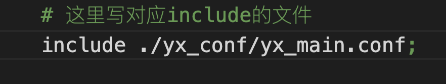
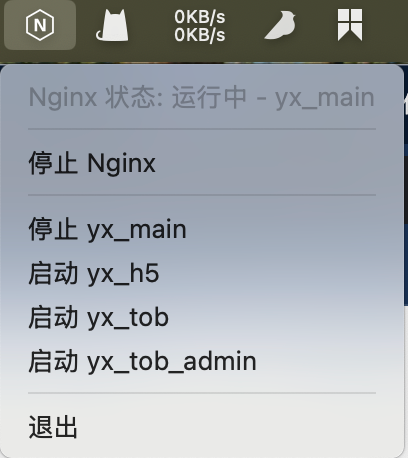
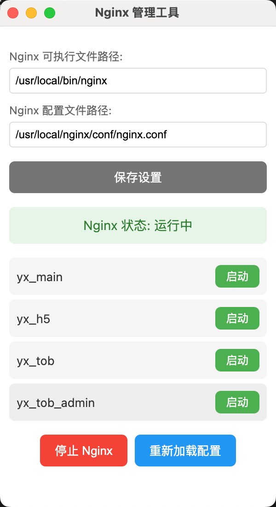

# quickNginx

## 项目描述

**quickNginx** 是一个用于快速管理 Nginx 的图形界面工具，旨在简化 Nginx 的配置和管理。

## 项目信息

- **版本**: 1.0.0
- **作者**: quickNginx Team

## 使用方法

1. **安装依赖**: 确保你已经安装了 Node.js 和 npm，然后在项目根目录下运行 `npm install` 来安装项目依赖。
2. **启动项目**: 运行 `npm start` 启动应用程序。
3. **开发模式**: 运行 `npm run dev` 以调试模式启动应用程序。
4. **打包应用**: 
   - 运行 `npm run pack` 进行打包。
   - 运行 `npm run dist` 生成适用于 macOS 的 arm64 和 x64 架构的安装包。

## 项目结构

- **src/**: 包含项目的源代码。
- **build/**: 包含构建相关的图标和资源。
- **scripts/**: 包含用于生成图标的脚本。
- **dist/**: 用于存放构建后的应用程序。

## 依赖

- **chalk**: 用于在命令行中输出彩色文本。
- **sudo-prompt**: 用于以管理员权限运行命令。

## 开发依赖

- **electron**: 用于构建跨平台的桌面应用。
- **electron-builder**: 用于打包和分发 Electron 应用。
别忘记添加注释 # 这里写对应include的文件 会在这个注释下面去修改include

